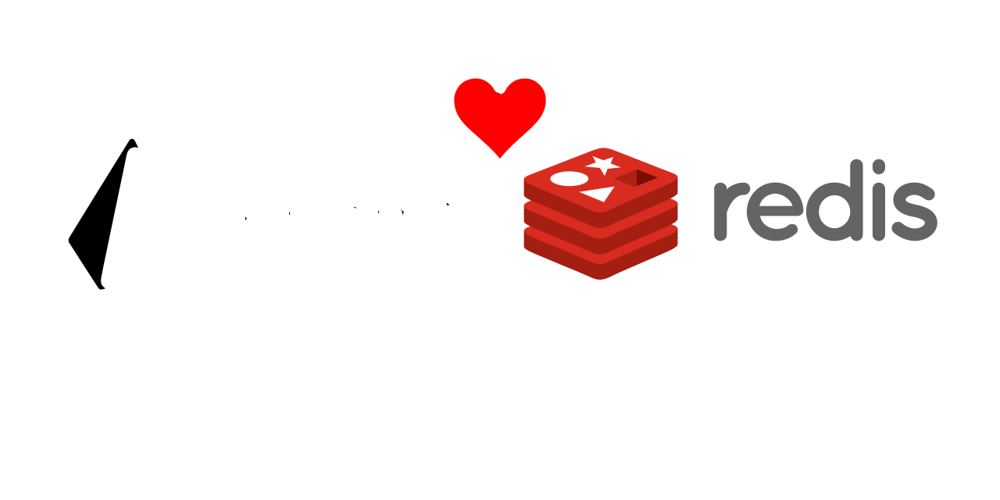

> [!WARNING]
> This small project is unmaintained. Use [Prisma Accelerate](https://www.prisma.io/accelerate).
>
> Originally, I made this Prisma Extension to learn more TypeScript, GitHub CI workflows, and NPM publishing.

# Redis cache for Prisma
<p align="center">
    
</p>
<h3 align="center">Streamlines caching Prisma operations using Redis with strong type-safety</h3>

<p align="center">
    <a href="https://opensource.org/license/mit">
        
    </a>
    <a href="https://www.npmjs.com/package/prisma-redis-cache">
        
    </a>
    <a href="https://github.com/Gabriel-434/prisma-redis-cache/actions/workflows/CI.yml">
        
    </a>
    
</p>

## Quick setup
Install the [Prisma Extension](https://www.npmjs.com/package/prisma-redis-cache):
```sh
npm install prisma-redis-cache
```

Configure the extension:
```ts
import {PrismaClient} from "@prisma/client"
import {env} from "node:process"
import configureCache from "prisma-redis-cache"
import {createClient} from "redis"

const redis = await createClient({
    url: env.REDIS_CONNECTION_URL
}).connect()

const prisma = new PrismaClient().$extends(
    configureCache({
        redisClient: redis
    })
)
```

Example usage:
```ts
const user = await prisma.user.findUnique({
    where: {
        username: "Gabriel"
    },
    select: {
        username: true,
        email: true,
        password: true
    },
    // ˅˅ - The per-operation caching options
    cache: {
        // | A unique key for the cache.
        // ˅ The key is automatically prefixed with the model name to avoid overlaps.
        key: `Gabriel`,
        // ˅ The time-to-live of the cache, in seconds **/
        ttl: 60 * 15
    }
})
```

That's it! You can start caching your Prisma operations _right away_ 🎉

> [!NOTE]
> The extension has **JSDoc documentation** and supports **IDE auto-completion**.
All Prisma operations except raw queries can interact with the cache.

## Flexible & easy-to-use cache interaction

### Create a new row and cache the selected data
```ts
await prisma.user.create({
    data: {
        username: "user",
        email: "user@example.com",
        password: "TheHashedUserPassword"
    },
    select: {
        username: true,
        email: true,
        password: true
    },
    cache: {
        key: `user`,
        ttl: 60 * 60
    }
})
```

### Update a row and cache the selected data
```ts
await prisma.user.update({
    where: {
        username: "user"
    },
    data: {
        email: "veryOriginalEmail@example.com"
    },
    select: {
        username: true,
        email: true,
        password: true
    },
    cache: {
        key: `user`,
        // ˅ Whether to update or evict the cache
        update: true,
        ttl: 60 * 60
    }
})
```

## Delete a row and evict the cache
```ts
await prisma.user.delete({
    where: {
        username: "user"
    },
    cache: {
        key: `user`
    }
})
```